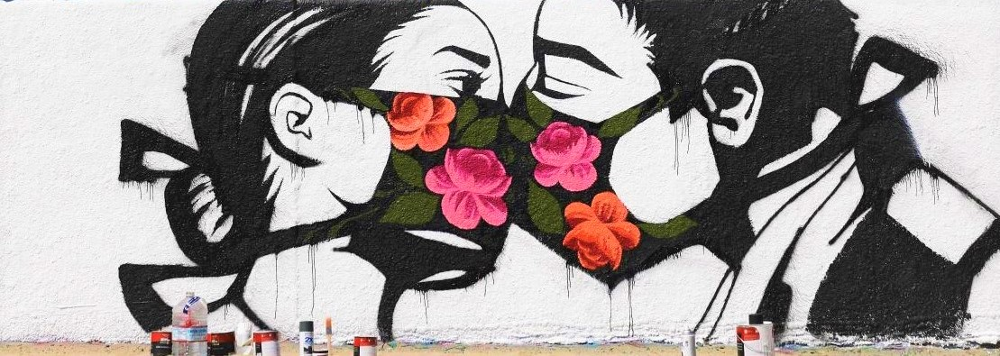

# Laboratoire du confinement

Ce repo contient les éléments d'une analyse en continu d'un fil de tweet défini par l'usage du hashtag #confinementJour1 à #confinementJour_n.

Cette analyse est conduite en 3 mouvements :

 * 1) extraction quotidienne des données dans API rest de twitter (et filtrage pour analyses spécifiques, ie uniquement les RT).
 * 2) annotation systématique avec les différents outils et constitution du fichier de travail.
 * 3) les analyses statistiques menées sur le fichier de travail : analyse baromètrique ( heure et jour), corrélation des indicateurs, segmentation des twittos.

A ce jour -j+26, la base primaire comporte 1.6 millions de tweets, rt et quote. Un extrait (df.rds) est disponible dans le repo pour tester les proc (le fichier entier dépasse les 1,5 Go). On se concentre sur les 270ko de messages primaires.

L'idée est de tester sur ce corpus des instrument de mesure du sentiment de manière systématique. Dans ce contexte l'objectif de projet est d'évaluer dans quelle mesure, ces outils permettent de capter les variations des émotions de la population au fil des jours et des évènements et de l'actualité. Les différents indicateurs sont-ils convergents? Sont-il fiables et sensibles?

En parallèle, une reflexion est engagée sur l'utilisation de cet intrument pour tester des hypothèses plus théoriques (ie : une théorie de l'adaptation par exemple se traduisant par un cycle stupéfaction/habituation/élaboration)

Le projet est ouvert, un petit groupe de travail s'est constitué spontanéement, on avance au jour le jour, pour y participer contactez en dm @benavent sur twitter. Le prochain rendez vous de travail sur #zoom est le mardi 8 avril à 14h). Les premiers membres du groupe sont  Sophie Balech (Amiens),  Michel Calciu (Lille), Julien Cloarec (Toulouse) , Valentin Mesa (Nanterre-mines), Christophe Benavent (Nanterre), Mehdi el Moukhliss(Toulouse), Jean-Fabrice Lebraty (Lyon) ...

L'analyse est centrée sur l'analyse du sentiment via les méthodes NCR, LSDfr et LIWC, on envisage des méthodes spécifiques et la vectorisation du corpus. Les premiers résultats sont [lisibles ici](https://benaventc.github.io/BarometreConfinement/LdC3_analyse_V01_bc.html)

Quelques questions en cours d'exploration:
  * [Introduction](https://benaventc.github.io/BarometreConfinement/LdC1_introduction_V01_bc.html)
  * Construire une [frise chronologique des évenements](https://docs.google.com/spreadsheets/d/1PQQzlgOht7NA8YWfwF7zyGWdI0zTFzJaRMXSE0h6vvo/edit?usp=sharing).
  * La procédure d'[extraction des tweets](https://benaventc.github.io/BarometreConfinement/LdC1_extract_V01_bc) et [celle d'annotation](https://benaventc.github.io/BarometreConfinement/LdC2_annotation_V01_bc)
  * La convergence des [annotateurs : nrc, Lsd fr, Liwc](https://benaventc.github.io/BarometreConfinement/LdC3_fiability_sentiment_V01_bc.html)
  * [Le traitement des emojis](https://benaventc.github.io/BarometreConfinement/confinement02_emojis.html)-  [Sophie Balech]
  * L'analyse des auto-corrélations et corrélations croisées (ts). Nous avons besoin d'un économètre. L'impact des "news" sur le sentiment. Un exemple avec le [discours du 13 avril](https://github.com/BenaventC/BarometreConfinement/blob/master/LdC3_effetmacron_V01_bc.html))
  * L'analyse par [profils d'utisateurs](https://benaventc.github.io/BarometreConfinement/LdC3_elementary_V01_bc.html) (induction du genre, fréquence de post, nb de followers). c'est en cours
  * Approche par LDA (Julien Monnot)
  * [Vectorisation du corpus](https://benaventc.github.io/BarometreConfinement/LdC2_vector_V1_Valentin.html) (pour créer des lexiques avec word2vec) - [Valentin Mesa]
  * Analyse des images (Julien Cloarec - Toulouse et Mehdi Elmoukhliss)
  * dashboard : avec [flexdashboard](https://rmarkdown.rstudio.com/flexdashboard/using.html#components)
  * Parallélisation des calculs sur le cluster de l'([Université de Lille](http://hpc.univ-lille.fr/cluster-hpc-htc)) by Michel Calciu. ( gain : de 8h de calcul pour l'annotation à 8mn). le [code est ici](https://benaventc.github.io/BarometreConfinement/LdC2_annotationParallele_V01_cm.html) 
  * La dimension spatiale via la geolocalisation des tweets est une néçessité, nous n'avons pas de spécialiste encore.
